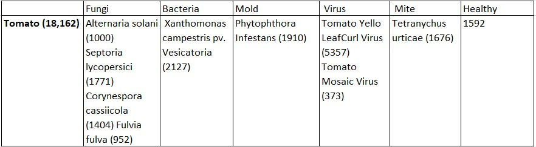

# tomato-xception
Deep learning project that aims to detect if a tomato leaf has a disease and which disease it has from 9 different ones.

# Dataset
Ten categories from the plant village dataset were used. The unaugmented data comes from a paper that used that dataset.
- [Original paper](arxiv.org/abs/1511.08060)
- [Dataset](data.mendeley.com/datasets/tywbtsjrjv/1)

List of their disease status in the database and the number of images in a particular class.

The main issue is that there are just 373 images of the Tomato Mosaic Virus. So 150 images went to the test set, 150 to val set and the rest to the train set. It was then upsampled using a data augmentation technique to reach 700. The other classes were downsampled to reach the same number of samples in each set.

# Results
Different models were trained acchieving different results.
- A convolutional neural network trained from scratch achieved 0.9333 validation accuracy. 
- The [xception](https://arxiv.org/pdf/1610.02357.pdf) architecture trained on the imagenet dataset used as a base, retrained unfrozen achieved the highest validation accuracy of 0.9973. It also achieved 0.9947 test accuracy but when tested on a set of [ipm](https://www.ipmimages.org/) images it had only 0.48 accuracy.
- Using the same xception base, it was first frozen and the top dense layers were trained, then the top three inception blocks were unfrozen and it was retrained. It achieved 0.9573 validation accuraccy and 0.9473 test accuracy but on the ipm dataset it achieved 0.65 accuracy.

